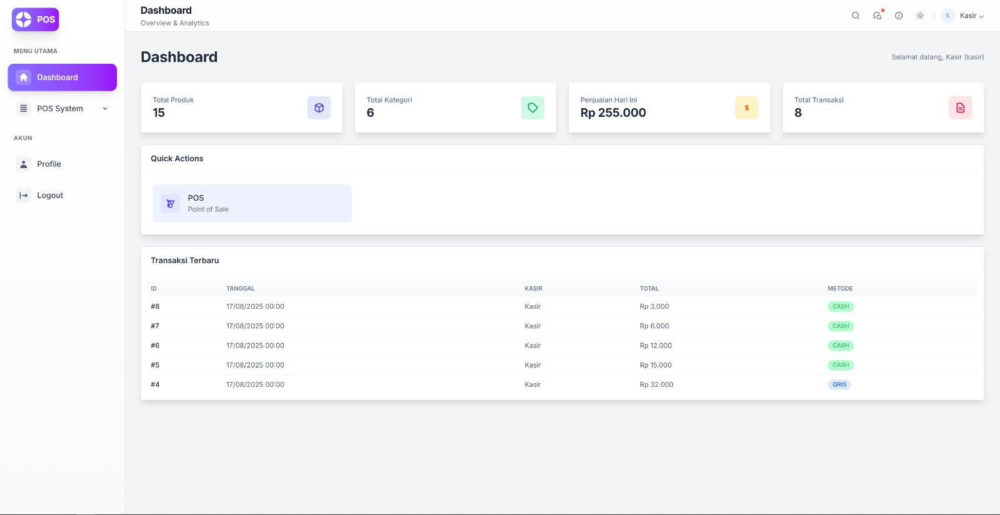

# 🚀 Sistem Point of Sale (POS) Modern  
[](LICENSE)  
  
  
  

**Sistem POS Modern** adalah aplikasi berbasis web untuk membantu bisnis retail, kafe, dan usaha kecil dalam mengelola produk, transaksi, dan laporan penjualan.  
Dibangun dengan **Laravel Jetstream** & **Tailwind CSS**, aplikasi ini responsif, cepat, dan mudah digunakan.  

  

---

## ✨ Fitur  

- 🛒 **Manajemen Produk & Kategori** – Tambah/edit produk, atur stok, harga, dan kategori dengan mudah.  
- 💳 **Antarmuka Kasir Cepat** – Proses transaksi dengan pembayaran via **Tunai, QRIS, Transfer**.  
- 📜 **Manajemen Transaksi** – Riwayat lengkap, cetak ulang struk, ekspor data.  
- 📈 **Laporan Lengkap** – Statistik penjualan harian, mingguan, bulanan, dan produk terlaris.  
- 👥 **Role-based Access Control** – Admin, Kasir, Pemilik dengan hak akses berbeda.  
- 📱 **UI Modern & Responsif** – Nyaman digunakan di desktop maupun mobile.  

---

## 🛠️ Teknologi  

- **Backend:** Laravel 11 + Jetstream  
- **Frontend:** Livewire, Tailwind CSS, Alpine.js  
- **Database:** MySQL / MariaDB  
- **Tambahan:**  
  - `barryvdh/laravel-dompdf` → Cetak struk PDF  
  - `mike42/escpos-php` → Cetak struk termal (opsional)  

---

## 🚀 Instalasi  

### Prasyarat  
- PHP **≥ 8.2**  
- Composer  
- Node.js & NPM  
- MySQL / MariaDB  

### Langkah-langkah  

```bash
# 1. Kloning repositori
git clone https://github.com/hbiiiii2/pos-system.git
cd pos-system

# 2. Instal dependensi
composer install
npm install

# 3. Konfigurasi environment
cp .env.example .env
php artisan key:generate
```

Edit `.env` sesuai database:  
```env
DB_CONNECTION=mysql
DB_HOST=127.0.0.1
DB_PORT=3306
DB_DATABASE=pos_system
DB_USERNAME=root
DB_PASSWORD=
```

```bash
# 4. Migrasi & Seeder
php artisan migrate --seed

# 5. Compile frontend
npm run dev

# 6. Jalankan server
php artisan serve
```

Akses: [http://127.0.0.1:8000](http://127.0.0.1:8000)  

---

## 🔑 Akun Demo  

- **Admin** → `admin@pos.com` | password: `password`  
- **Kasir** → `kasir@pos.com` | password: `password`  
- **Pemilik** → `owner@pos.com` | password: `password`  

---

## 🤝 Kontribusi  

1. Fork repo  
2. Buat branch fitur: `git checkout -b fitur-baru`  
3. Commit: `git commit -m "Tambah fitur X"`  
4. Push & buka Pull Request  

Kontribusi berupa PR, laporan bug, atau ide fitur sangat terbuka 🙌  

---

## 📄 Lisensi  
Dirilis di bawah **MIT License** – lihat [LICENSE](LICENSE).  
